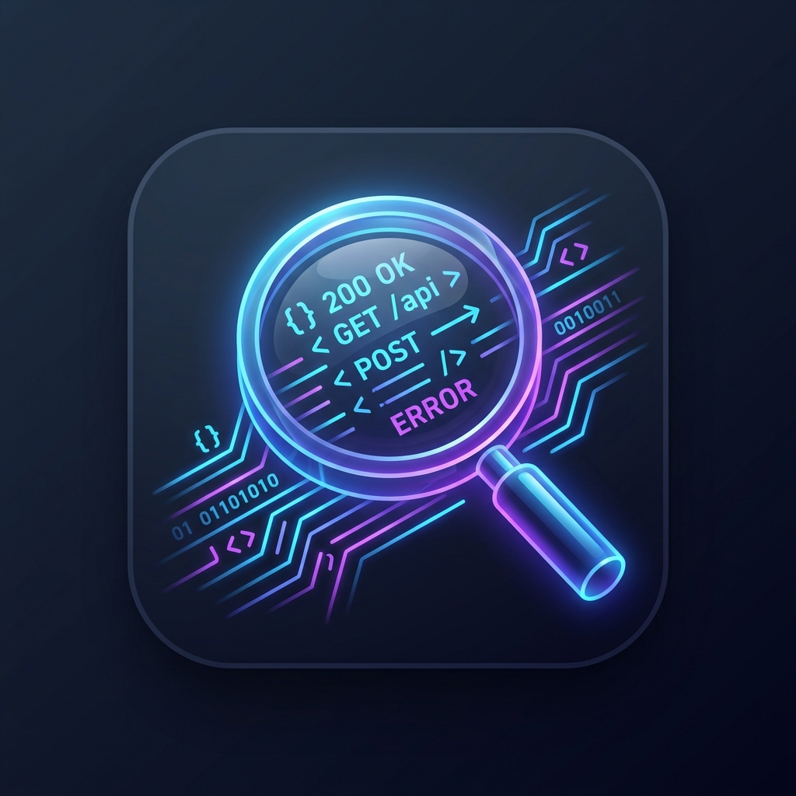

# CPI Log Lens



A self-hosted web application for downloading, storing, and analyzing SAP Cloud Integration (CPI) logs.

## Features

- 📥 **Fetch** — download HTTP and trace logs from any number of CPI tenants via OAuth2
- 🔍 **Browse** — search and filter log entries by level, IFlow, message content and date range
- 📊 **Stats** — error distribution per IFlow, level breakdown, hourly timeline
- ⚙️ **Settings** — manage tenant credentials via UI or `config/tenants.jsonc`
- 🐳 **Docker** — runs anywhere with `docker compose up`
- 🧪 **Mock mode** — works without a real CPI connection for local development

## Quick Start

```bash
# 1. Clone
git clone https://github.com/FinkeFlo/cpi-log-lens
cd cpi-log-lens

# 2. Start (no configuration needed)
docker compose up -d

# 3. Add a tenant in Settings, or seed tenants from a file:
#    cp config/tenants.jsonc.example config/tenants.jsonc   (then restart)
#    Try it without a CPI tenant: MOCK=true docker compose up -d

# 4. Open
open http://localhost:8080
```

## Tenant Configuration

Add tenants in the **Settings** page, or seed them from **`config/tenants.jsonc`** (JSON with comments, gitignored). By default the file only adds tenants that don't exist yet; set `TENANTS_SEED_MODE=sync` to make the file the source of truth.

```jsonc
{
  "tenants": [
    {
      // Short ID used in the UI (lowercase, no spaces)
      "id": "dev",
      "name": "DEV",

      // From SAP BTP → Instances & Subscriptions → Cloud Integration → Service Key
      "api_url":      "https://your-tenant.it-cpi018.cfapps.eu10-003.hana.ondemand.com",
      "oauth_url":    "https://your-tenant.authentication.eu10.hana.ondemand.com/oauth/token",
      "client_id":    "sb-your-client-id",
      "client_secret": "your-client-secret"
    }
    // Add as many tenants as you need
  ]
}
```


## Mock Mode

To run without a real CPI connection (for demos or local development):

```bash
MOCK=true docker compose up
```

Imports the sample log files from `backend/mock/` instead of calling the CPI API.

## Log Format

CPI uses a SAP-proprietary `#`-delimited format with 15 fields:

```
Timestamp # Timezone # Level # Logger # User # IFlow # Category # ... # Message # - # IP # Node
```

All fields are parsed and indexed into a local DuckDB database for fast querying.

## LLM / Automation API

Two endpoints allow LLMs or external tools to query logs programmatically.

### `GET /api/query/schema`

Returns a description of the query API — available filters, field names, and configured tenants. A good starting point for LLMs to orient themselves.

```bash
curl http://localhost:8080/api/query/schema
```

### `POST /api/query`

Search log entries with structured filters. Returns a natural-language `summary` plus matching `items`.

```bash
curl -X POST http://localhost:8080/api/query \
  -H "Content-Type: application/json" \
  -d '{
    "tenant":    "dev",
    "level":     "ERROR",
    "iflow":     "MyIFlow",
    "grep":      "authorization failed",
    "date_from": "2024-01-01 00:00:00",
    "date_to":   "2024-01-31 23:59:59",
    "limit":     50
  }'
```

All fields are optional. Response:

```json
{
  "total_matching": 142,
  "returned": 50,
  "summary": "Found 142 log entries matching tenant=dev, level=ERROR. Returning 50 of 142.",
  "items": [ { "id": 1, "tenant": "dev", "level": "ERROR", "iflow": "...", "message": "...", ... } ]
}
```

| Field | Type | Description |
|---|---|---|
| `tenant` | string | Tenant ID — omit for all tenants |
| `level` | string | `ERROR`, `WARN`, `INFO`, `DEBUG` |
| `iflow` | string | Partial IFlow name match |
| `grep` | string | Full-text search in `message` and `logger` |
| `date_from` | string | Start datetime `YYYY-MM-DD HH:MM:SS` |
| `date_to` | string | End datetime `YYYY-MM-DD HH:MM:SS` |
| `limit` | int | Max entries returned (1–200, default 50) |


| Path | Contents |
|---|---|
| `data/cpi_logs.duckdb` | DuckDB database (all imported log entries) |
| `data/logs/<tenant>/` | Raw downloaded log files (gzip) |
| `config/tenants.jsonc` | Optional tenant seed file — **do not commit** |

Both `data/` and `config/tenants.jsonc` are excluded from git.

## Stack

- **Backend** — Python, FastAPI, DuckDB, httpx
- **Frontend** — Alpine.js, Tailwind CSS, DaisyUI, Chart.js
- **Storage** — DuckDB
- **Runtime** — Docker / Docker Compose

## License

MIT
